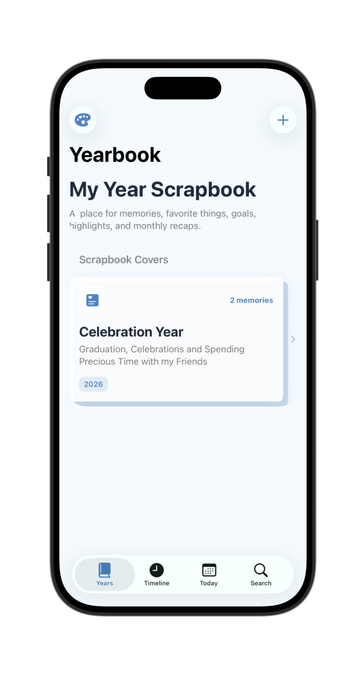
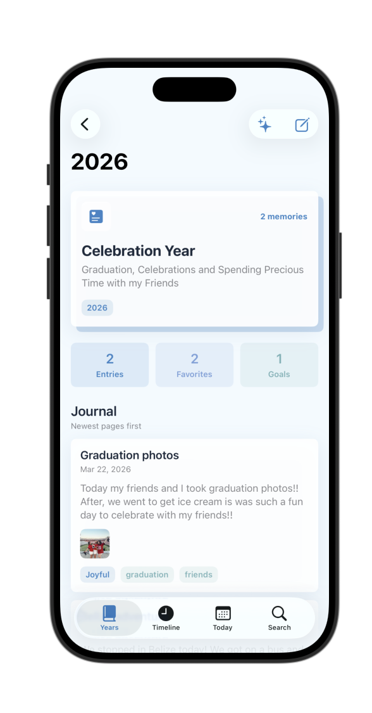
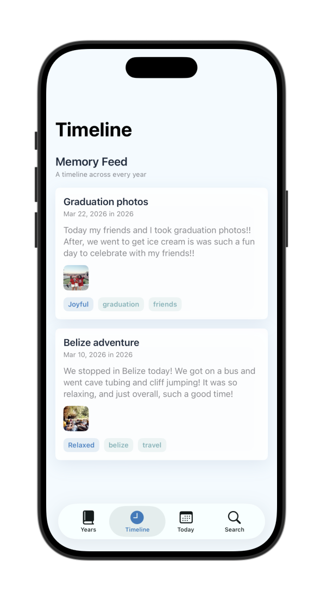

# Yearbook

Yearbook is a cozy SwiftUI scrapbook app for saving memories by year. Each yearly scrapbook can include journal entries, photos, favorites, goals, highlights and a timeline of moments documented. The app is designed to feel personal, nostalgic, and easy to customize, with soft cards, rounded details, and selectable color schemes.

## Screenshots

### Home

### Year Detail

### Timeline

## Features

- Create yearly scrapbook collections
- Add journal entries with dates, moods, tags, and photos
- Save favorites and goals for the year
- Browse memories in a timeline feed
- Search by keyword, tag, month, or year
- View "On This Day" memories
- Switch between color schemes including pink, blue, green, red, yellow, purple, and orange
- Persist scrapbook data locally with SwiftData

## Built With

- SwiftUI
- SwiftData
- MVVM-style organization
- Xcode

## Setup Instructions

1. Clone or download this repository.
2. Open `Final Project/Final Project.xcodeproj` in Xcode.
3. Select an iPhone Simulator.
4. Press `Run` to build and launch the app.

The app uses local SwiftData storage, so no external API keys or accounts are required.
